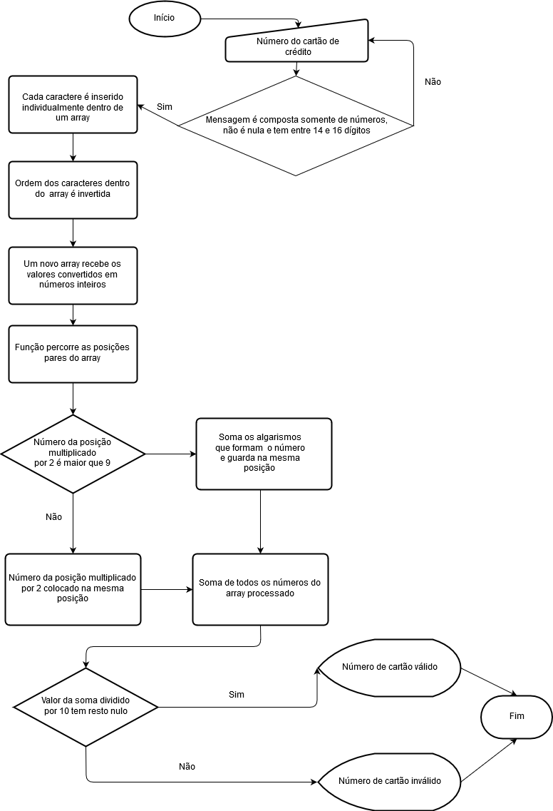

Programa de validação de cartão de crédito através do algoritmo de Luhn.

Início

- No arquivo java script (app.js)  é chamada a função para validação do número (function isValidCard(cardNumber) {}) com parâmetro inicial nulo (isValidCard('0')); 

- A função através do prompt pede ao usuário que digite uma mensagem a ser codificada:

var cardNumber = prompt("Digite o número do cartão de crédito que deseja consultar");

- A mensagem deve conter apenas números, não ser vazia e ter entre 14 e 16 números. Enquanto a condição não for satisfeita o processo permanece em loop: 

while (cardNumber.search(/[^0-9]/) !== -1 || cardNumber[0] === undefined || cardNumber.length<14 || cardNumber.length>16) {
    cardNumber = prompt("Valor incorreto. Digite somente os números do cartão de crédito que deseja consultar");
  }.

Processamento de validação

- Quando a condição de entrada de mensagem é satisfeita são declaradas as variáveis que serão utilizadas no processamento e algumas funções já são aplicadas:

	1- É criada uma variável do tipo array que receberá os valores dos números digitados divididos através da função 
	Array.prototype.split()   (var arrString = cardNumber.split('')) ;
	2- O string contendo os valores divididos tem ordem dos valores invertidos através da função Array.prototype.reverse () 
	(arrString.reverse()); 
	3- É criada uma variável do tipo array que receberá os strings do array anterior transformados em números (var arrNumber 
	= []).

- O processo de validação  é executado da seguinte maneira:

	1- Uma função percorre cada um dos strings do arrString e o arrNumber recebe cada um desses valores convertidos para 
	números inteiros para cálculo das equações de validação.
	
  	for (var i in arrString) {
	  arrNumber.push(parseInt(arrString[i]));};

	2- Uma função percorre as posições pares do array com os números inteiros e sao testadas condições para os valores	 	 contidos nessas posições. Se o número estiver na posição par do array multiplicado por 2 for maior que 9 uma operação é
	executada, caso contrario outra operacao é executada e as posicoes do array recebem os valores resultantes dessas
	operaçcões:

	for (var i = 1; i < arrNumber.length; i += 2){
	  if ((arrNumber[i] * 2) > 9) {
	    arrNumber[i] = (Math.trunc((arrNumber[i] * 2) / 10)) + ((arrNumber[i] * 2) % 10);
	  } else {
	    arrNumber[i] = arrNumber[i] * 2;
	  }
        };

	5- Finalizados esses passos é feita a soma de todos os números do array resultante dos processos anteriores através do 
	seguinte comando:
	
	for (var i = 0, sum = 0; i < arrNumber.length; sum += arrNumber[i++]){};

	6- É executado o processo de validação do número de cartão de crédito, se o modulo da soma dos números do array
	processado por 10 for nulo o cartão é valido, caso contrario inválido. As mensagens são retornadas para o usuário no 
	HTML com essas informações:

	document.getElementById('cardNumber').innerHTML = cardNumber;
	if (sum % 10 === 0) {
	  return document.getElementById('validation').innerHTML = ' Válido';
        } else {
	    return document.getElementById('validation').innerHTML = ' Inválido';
        };

Fim do processo

